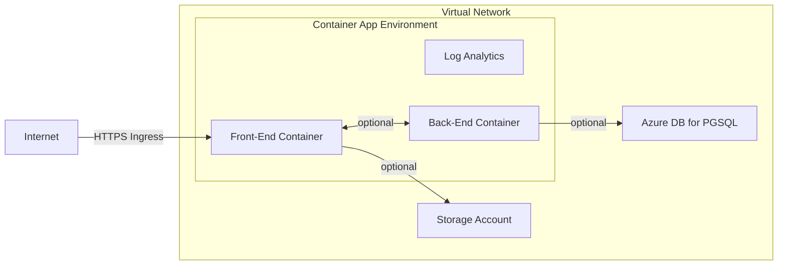
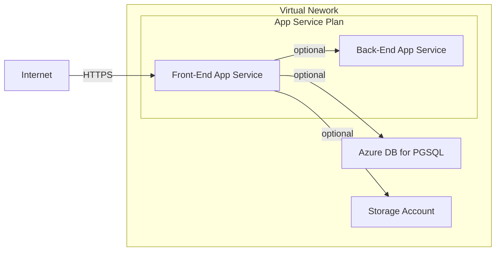
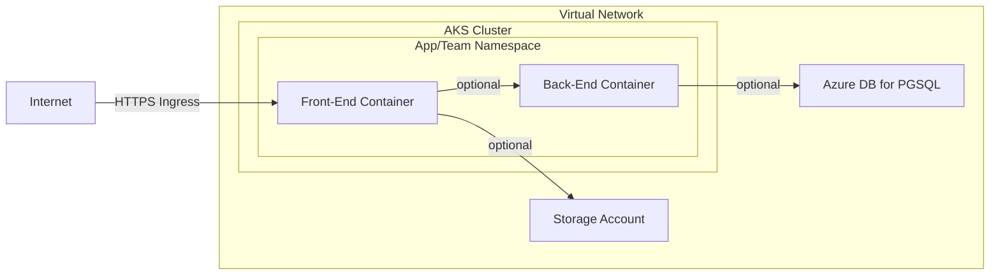

# .NET Web App Development Environment on Azure

[](https://github.com/mirfire/azure-bicep-training/actions/workflows/arm-build.yaml)

This repository hosts the necessary Bicep code to deploy a .NET web app on Azure. This is made as an exploration and practice of [Bicep](https://learn.microsoft.com/en-us/azure/azure-resource-manager/bicep/overview)

## Context

A team needs a simple infrastructure for developing and testing a new product, in Azure. They plan to use a database, and storage. They might also make an API on top of it later.

## Constraints

- Must be accessible from the Internet
- Must be highly available
- Must be replicable
- Must allow for a database to be brought on later

## Useful Docs

- [Bicep Docs](https://learn.microsoft.com/en-us/azure/azure-resource-manager/bicep/overview)
- [Azure Template References](https://learn.microsoft.com/en-us/azure/templates/)
- [Container Apps Docs](https://learn.microsoft.com/en-us/azure/container-apps/)

## Implemented Solution



The implemented solution uses Azure Container Apps and deploys everything through a self-contained Bicep module, with various submodules. Using them, we deploy an ASP.Net application. The code and image of which are in the [mirfire/dotnet-hello-world](https://github.com/mirfire/dotnet-hello-world) repository.

This solution 

### Submodules

- `app`:
  - This is the module for the teams. Through variables, it will deploy a the following resources
    - A storage account
      - An `AzureFiles` share for each volume of the containers
      - A storage mount in the `managedEnvironment` for each volume of the containers
    - A container App for each one defined in the `containers` parameter (currently only accessible through the main module)
      - Each container will use the storage mount defined above
      - They can be externally available by setting `containers[].ingress.external: true`
- `container`:
  - Deploys a container app, taking one `ContainerApp` as argument
- `containerAppEnvironment`:
  - Deploys the managed environment to run the apps on. 
- `database`:
  - Deploys a PostgreSQL database server
  - Creates as many databases as requested
- `network`
  - Deploys a virtual network, with one hardcoded subnetwork.
- `storageaccount`
  - Deploys a storage account
  - Accepts a list of subnets to allow connections from. Else disallows public access.
  - Used in `app`
- `volumeMountShares`
  - Submodule responsible for the creation of the shares in the storage account and of the storages in the managed environment
  - Used in `app`

Assembling those modules in `src/main.bicep`, we deploy the infrastructure, and one application from a team.

Additionally, some custom types were defined in `src/types.bicep`, like `ContainerApp`.

### Parameters

An example parameter file is available in the `src/main.bicepparam.dist` file. Using these parameters, we deploy an ASP.Net application. The code and image of which are in the [mirfire/dotnet-hello-world](https://github.com/mirfire/dotnet-hello-world) repository.

### Achieved Goals

Using the parameters from above, we achieve the following:

- The app is highly available (3 replicas, each one 1 availabilty zone in west europe)
- Deployment is replicable using the parameters provided
  - They can be changed to deploy the same infrastructure for a different team or environment
- A database can be brought on with some modifications to the deployment

### Limitations

- Limited networking
  - The module deploys one vnet, with one hardcoded subnet for the managed environment
  - There is no route table
- No firewall protection
  - The ManagedEnvironment is exposed to the internet through ingresses on the apps
- Currently no database
  - A rough database submodule has been created
  - A subnet would need to be created
  - Communication between the ManagedEnvironment's subnet and the database subnet would need to be enabled through routes
  - Only deploys PostgreSQL servers
    - Needs to be further parameterized to allow other 
- Container definitions are extremely limited
  - Only one container per app
  - No init containers
  - Only one exposed port at most
  - No health checks
  - No revisions
  - No split traffic between revisions
  - This would probably need a redesign how the app deployment pipeline
- Extremely basic monitoring
  - Logs are not stored, as there is no Log Analytics Workspace
  - No alerts are deployed
- No secret management
  - Secrets can be stored at the container app level

### Future Changes

#### Decide of the Architecture

If Azure Container Apps are a worthy solution, decisions should be taken on how to integrate them with the current infrastructure, and how they should be shared between environments and teams. 

- Should each team have a few managed environments of their own ? 
- Should a cloud engineering team manage it for them and give them the tools to deploy onto them ?

[Quotas](https://learn.microsoft.com/en-us/azure/container-apps/quotas) should be kept in mind when planning this out.

#### Database

No databases are currently deployed, but the necessary preparations are already made. There a submodule for it and the managed environment subnetwork can already access `Microsoft.Sql` service endpoints.

We will need a Key Vault or some sort of secret management for this, to store the database passwords.

#### Secret Managements

There is currently no secret management in this module, besides the secrets at the Container App level. To help link correctly the databases, and store other important information that might be shared between multiple apps, deploying an Azure Key Vault could be a solution.

#### App Deployments

App deployments should be made outside of this module through a CI/CD pipeline. This can be done directly from [Github Actions](https://learn.microsoft.com/en-us/azure/container-apps/github-actions).

Currently, the module deploys the infrastructure, and the apps. The `app` submodule can be used separately by each time that will want to deploy something, as long as they know the name of the Managed Environment to deploy on.

The way of deploying the apps will determine [which features](https://learn.microsoft.com/en-us/azure/container-apps/overview#features) are accessible to the teams.

#### Better Management of Networking

We currently assume that there is no other network to talk with or integrate in. In a real setting that probably won't happen and we would have to rethink how the networking is currently managed

#### Private Container Registry

Currently we deploy an app from a public container registry. In the future, a private image registry should be provisioned and provided to the teams.

## Other Possible Solutions

### App Service Based (PaaS)

Deploying code directly to an Azure-controlled environment through App Service. Works, though possibly more expensive than a container-as-a-service based solution as we are billed for the underlying machine(s) running the code. Although they can be shared between multiple apps.

- Platform as a Service
- Deploying code directly
- Very little to manage



### Azure Kubernetes Service Based (IaaS)

- Based on containers
  - More portable
  - More flexible
  - Requires packaging
- A whole Kubernetes cluster needs to be managed
- The whole Kubernetes ecosystem becomes available
- Pricing
  - Management fee per cluster per hour
  - Underlying VMs

Deploying and managing one or more Kubernetes cluster (1 per environment?), we can then create namespaces to separate deployment between teams, departments, or whatever makes sense for the current situation.

This is very similar to the Container Apps based solution, but here we are in full control (and responsability) of the Kubernetes cluster. Additional services could be deployed on top of it to enable more features for our teams, like ArgoCD for example.



## Issues Encountered

### Floats are not supported

Surprisingly, Bicep does not currently support floating point numbers. They have to be wrapped in JSON for them to be interpreted.

Sources:

- https://github.com/github/pets-workshop/pull/13
- https://github.com/Azure/bicep/issues/1386
- https://github.com/Azure/bicep/issues/5993#issuecomment-1043170716

### Subnet declared separately from network gets deleted

With the following piece of code, the subnet is getting deleted each time by a deployment (and fails because the subnet is in use by the container environment).

```bicep
resource network 'Microsoft.Network/virtualNetworks@2023-09-01' = {
  name: name
  location: location
  tags: tags
  properties: {
    addressSpace: {
      addressPrefixes: vnetAddressPrefix
    }
  }
}

resource subnet 'Microsoft.Network/virtualNetworks/subnets@2023-09-01' = {
  parent: network
  name: 'infra'
  properties: {
    addressPrefix: subnetAddressPrefix
  }
}

output id string = network.id
output name string = network.name

output subnetId string = subnet.id
output subnetName string = subnet.name
```

Declaring the subnet in the network directly likes this fixes the issue.

```bicep
resource network 'Microsoft.Network/virtualNetworks@2023-09-01' = {
  name: name
  location: location
  tags: tags
  properties: {
    addressSpace: {
      addressPrefixes: vnetAddressPrefix
    }
    subnets: [
      {
        name: 'infra'
        properties: {
          addressPrefix: subnetAddressPrefix
          privateEndpointNetworkPolicies: 'Disabled'
          serviceEndpoints: [
            {
              service: 'Microsoft.Storage'
            }
            {
              service: 'Microsoft.Sql'
            }
          ]
        }
      }
    ]
  }
}
```

Problably linked to [this issue on the Bicep repo](https://github.com/Azure/bicep-types-az/issues/1687).
