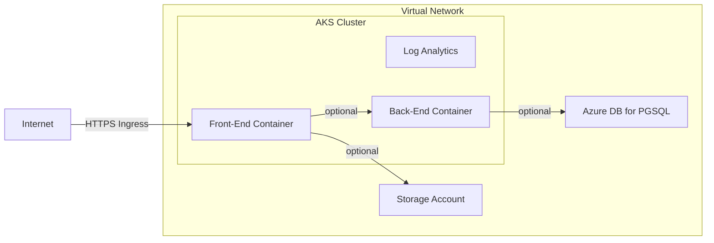

# .NET Web App Development Environment on Azure

[](https://github.com/mirfire/azure-bicep-training/actions/workflows/arm-build.yaml)

This repository hosts the necessary Bicep code to deploy a .NET web app on Azure. This is made as an exploration and practice of [Bicep](https://learn.microsoft.com/en-us/azure/azure-resource-manager/bicep/overview)

## Context

A team needs a simple infrastructure for developing and testing a new product, in Azure. They plan to use a database, and storage. They might also make an API on top of it later.

## Constraints

- Must be accessible from the Internet
- Must be highly available
- Must be replicable
- Must allow for a database to be brought on later

## Useful Docs

- [Bicep Docs](https://learn.microsoft.com/en-us/azure/azure-resource-manager/bicep/overview)
- [Azure Template References](https://learn.microsoft.com/en-us/azure/templates/)
- [Container Apps Docs](https://learn.microsoft.com/en-us/azure/container-apps/)

## Possible Solutions

### Container Apps Based (CaaS)

Packaging the code into a container image, then running that image in an Azure-controlled environment.

- Based on containers
  - More portable
  - More flexible
  - Requires packaging
- Limited management of the Container Apps Environments
- Pricing
  - Dedicated
    - Flat management fee
    - Per vCPU/h & Memory/h
  - Consumption
    - Per million request 
    - Per vCPU/s & Memory/s


### App Service Based (PaaS)

Deploying code directly to an Azure-controlled environment through App Service. Works, though possibly more expensive than a container-as-a-service based solution as we are billed for the underlying machine(s) running the code. Although they can be shared between multiple apps.

- Platform as a Service
- Deploying code directly
- Very little to manage


### Azure Kubernetes Service Based (IaaS)

- Based on containers
  - More portable
  - More flexible
  - Requires packaging
- A whole Kubernetes cluster needs to be managed
- Pricing
  - Management fee per cluster per hour
  - Underlying VMs

Deploying and managing one or more Kubernetes cluster (1 per environment?), we can then create namespaces to separate deployment between teams, departments, or whatever makes sense for the current situation.

This is very similar to the Container Apps based solution, but here we are in full control (and responsability) of the Kubernetes cluster.



## Implemented Solution

### Limitations


## Issues Encountered

### Floats are not supported

Surprisingly, Bicep does not currently support floating point numbers. They have to be wrapped in JSON for them to be interpreted.

Sources:

- https://github.com/github/pets-workshop/pull/13
- https://github.com/Azure/bicep/issues/1386
- https://github.com/Azure/bicep/issues/5993#issuecomment-1043170716

### Subnet declared separately from network gets deleted

With the following piece of code, the subnet is getting deleted each time by a deployment (and fails because the subnet is in use by the container environment).

```bicep
resource network 'Microsoft.Network/virtualNetworks@2023-09-01' = {
  name: name
  location: location
  tags: tags
  properties: {
    addressSpace: {
      addressPrefixes: vnetAddressPrefix
    }
  }
}

resource subnet 'Microsoft.Network/virtualNetworks/subnets@2023-09-01' = {
  parent: network
  name: 'infra'
  properties: {
    addressPrefix: subnetAddressPrefix
  }
}

output id string = network.id
output name string = network.name

output subnetId string = subnet.id
output subnetName string = subnet.name
```

Declaring the subnet in the network directly fixes the issue. 

Problably linked to [this issue on the Bicep repo](https://github.com/Azure/bicep-types-az/issues/1687).
